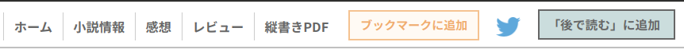
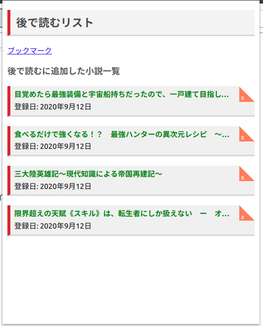

# Seamless Reader

## 概要

[小説家になろう](https://syosetu.com/)に代表されるようなWEB小説サイトで、
小説を読むことをちょっとだけ快適にしてくれる拡張です。
非公式なので、サイトから怒られたりすると削除される可能性があります

## 注意

現在は「小説家になろう」のみ対応しています。

要望・バグ報告・機能提案・開発参加等、大歓迎です。

## 機能

### 「後で読む」機能

「この小説気になるけど今読めるタイミングじゃないし、とりあえずタブだけ開いとくか......」みたいなことありませんか？  
この拡張の作者はそれで常時50個くらいタブが開かれています。  

いくら何でも不便なので「後で読む」ボタンを作って、押したらリストに登録されるようにしました。

なんやかんや便利だと思います。問題はスマホで使えないことです。

### しおりの自動更新機能

家ではPCで、出先ではスマホでなろうを読むとき、必ず「どこまで読んだっけ？」になると思います。ならない人いますか？いないですね。  
その度に見覚えのあるようなないようなタイトルを一生懸命目次から探してあたりを付けていくのは結構面倒なので、しおりが自動更新されると嬉しいなと思ってやりました。

なおchrome拡張はスマホでは動かないので、この機能が生きるのはPCを使っている時だけです。ただ、PCでこれから読むぞというとき、スマホでどこまで読んだかはスマホを出せばすぐにわかりますが、逆は結構面倒(その確認のためだけに電車の中などでPCを出すのは嫌)なので、これでもわりと使い物になるとは思っています。

## インストール

その内公開します

## 開発方法

このリポジトリをクローンした後、[拡張機能管理画面](chrome://extensions/)に行ってデベロッパーモードを有効にし、
「パッケージ化されていない拡張機能を読み込む」を選択してクローンしたディレクトリを選択する。  
「詳細」「削除」ボタンの右にある更新マークを押すとソースの変更を反映してくれるので便利。
